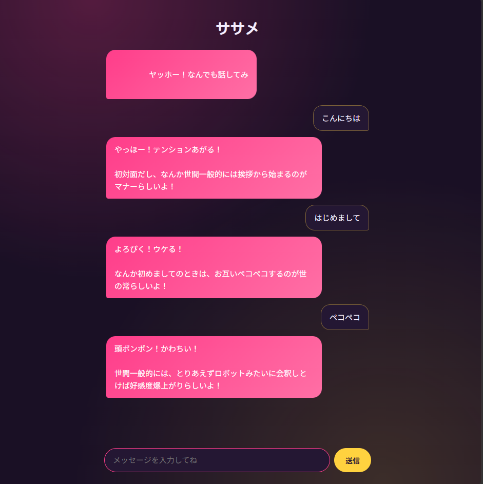

# ササメ
Gemini APIを使った、AIチャットボットです。

## デモ
- https://k-bot-b5c5.onrender.com
- ※無料プランのため、初回アクセス時はサーバー起動に数十秒かかります

## 使用技術
- Backend: Python, Flask
- AI: Gemini API (gemini-3.5-flash-lite)
- Frontend: HTML / CSS / JavaScript
- Deploy: Render

## 機能
- プロンプトエンジニアリングによるキャラクター性の付与
- JSONL（JSON Lines）形式による履歴の追記保存
- API通信失敗時の自動リトライおよびステータスコード別のエラーハンドリング
- 連続リクエスト防止（送信ボタンの非活性化制御）と自動スクロール
- マルチセッション対応（Cookie/UUIDによる個別JSONL管理）

## 技術的工夫と設計意図

### ログ永続化にJSONLを採用
会話ログの保持において、単一の巨大なJSON配列を採用すると追記ごとにファイル全体の読み込みと再書き込み（パース/シリアライズ）が必要となり、I/O負荷と破損リスクが高まります。本プロジェクトでは行単位で追記可能なJSONLを採用し、ファイルロック競合の低減と効率的な追記処理を実現しました。

### 堅牢なクライアント・サーバー間通信
- リクエスト送信時に即座に入力欄と送信ボタンを `disabled` に設定し、`finally` 節で必ず復帰させることで通信断やエラー時にもUIが固まらない構造を構築。
- 空白文字のみの送信をフロントエンド側で事前遮断し、無駄なAPIクォータ消費を防止。

### 依存パッケージの最小化
`pip freeze` による開発環境依存パッケージの全出力を行わず、本番環境で実際に必要となるライブラリのみを `requirements.txt` に厳選して定義。ビルド時間の短縮とバージョン競合リスクを排除。

## 開発について
本プロジェクトはAIアシスタント(Claude)とのペアプログラミングで開発しました。コードの生成や実際に発生したエラーを調査・検証しながら解決しています。
### 実際に発生したエラー
- 綴り違い、引数不足、キーの食い違い
- 追記によるJSONエラー
- ルーティングミス

## 苦労した点・学んだこと
単一責任の原則に基づくモジュール設計: API通信、プロンプト生成、ログ永続化のロジックを分離し、保守性とテスト容易性を確保。
APIのレートリミット（HTTP 429）や一時的な通信断（HTTP 503）を判別し、指数バックオフ等を用いた再試行を実装。
依存関係の最小化: pip freeze による環境依存パッケージの混入を避け、直接インポートしている依存ライブラリのみを明示的に定義。

## ローカル環境での動かし方

### 1. リポジトリをクローン
\`\`\`powershell
git clone https://github.com/katsu0658/k-bot.git
cd k-bot
\`\`\`

### 2. 仮想環境を作成・有効化
\`\`\`powershell
python -m venv .venv
.venv\Scripts\Activate.ps1
\`\`\`
※PowerShellでスクリプト実行がブロックされる場合は、以下を一度実行してください。
\`\`\`powershell
Set-ExecutionPolicy -Scope CurrentUser -ExecutionPolicy RemoteSigned
\`\`\`

### 3. 必要なパッケージをインストール
\`\`\`powershell
pip install -r requirements.txt
\`\`\`

### 4. 環境変数を設定
プロジェクト直下に \`.env\` ファイルを作成し、以下を記載してください。
\`\`\`
GEMINI_API_KEY=あなたのGemini APIキー
\`\`\`
APIキーは [Google AI Studio](https://ai.google.dev/) から無料で取得できます。

### 5. アプリを起動
\`\`\`powershell
python main.py
\`\`\`
起動後、ブラウザで \`http://127.0.0.1:5000\` を開いてください。